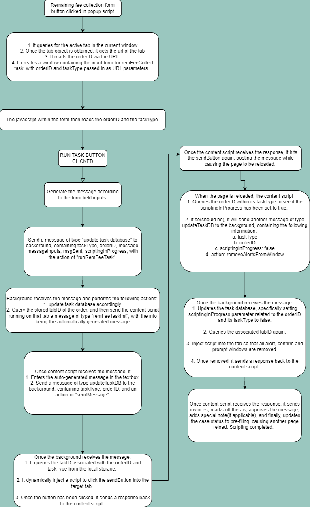

## Function: `sendMsgToUpdteTskDB(TaskInfoObject)`

Sends a message of type `messageTypes.updateTaskDB` from `content script` to `background script` to update the task database using the information provided in the `TaskInfoObject`.

---

### 📦 Message Structure

```javascript
{
  type: messageTypes.updateTaskDB,  
  info: {                           
    taskType: aisNames.remFeeCollect,
    orderID: "12345",
    taskStatus: "pending"
    // Additional fields from TaskInfoObject...
  }
}
```

### 📦 Parameters

#### `TaskInfoObject` (Object)

An object containing details about the task. It has the following fields:

#### ✅ Required:

- **`taskType`** (`string`) : Type of the task. For a list of possible values, please refer to the aisNames object. 

- **`orderID`** (`string`) : Order ID of the task.

- **`taskStatus`**(`string`): Current status of the task. For a list of possible values, please refer to the taskStatuses object. 


#### ⚙️ Optional:

- **`messageInputs`**(`object`): An object containing parameter values needed for automatic message-writing.
- **`message`**(`string`): The fee-collection message for the task. 
- **`msgSent`**(`boolean`): Boolean indicating whether the message has been sent.
- **`tabID`**(`number`): ID of the browser tab with the task order inside.
- **`scriptingInProgress`**(`boolean`): Indicating if scripting is currently ongoing.
- **`currentScriptingStep`**: 

---

### 📌 Example

```javascript
sendMsgToUpdteTskDB({
    taskType: aisNames.remFeeCollect, 
    orderID: "12345",
    taskStatus: taskStatuses.statusPend 
    messageInputs: {}, 
    msgSent: true, 
    message: "....", 
    tabID: tabDummy, 
    scriptingInProgress: false, 
    currentScriptingStep: remFeeKeySteps.dummyStep
});
```

## Function `processQueue(queue, queueType, tabID)`

### 📦 Parameters

#### ✅ Required:

- **`queue`** (`array`): An array of objects to be processed.

- **`queueType`** (`string`): A string indicating the type of queue that the function is currently processing. 

*Please note: both the queue and queueType will come from queue objects stored within [queues object](#queues-object) defined prior in the background script.*


## Queues Object:

The queues object uses the **values** in [localStorageKeys](#localstorage-keys-object) as its **keys**. 

Each key corresponds to a single queue object, which contains an empty array and its queue type. 

---

### 📌 Example:

```javascript
const queues = {
    [localStorageKeys.scriptRunningStatusesDB]: 
    {queue: [], queueType: localStorageKeys.scriptRunningStatusesDB},

    [localStorageKeys.taskDataBase]: 
    {queue: [], queueType: localStorageKeys.taskDataBase},

    [localStorageKeys.activelyManagedTabs]: 
    {queue: [], queueType: localStorageKeys.activelyManagedTabs}
}
```


## localStorage Keys Object

This is an object containing **values** that can be used as **keys** to set/get the [local storage](#the-local-storage).


---

## 📦The local storage

### 🔑The Key: **`localStorageKeys.scriptRunningStatusesDB`** (**`"Scripts Statuses"`**)

### 📄The Value:

An object with the type of content script as keys, and its active/inactive status as values. All possible content script types are in the object **`scriptNames`**.

### 📌Example:

```javascript

{
    "Scripts Statuses": {"Remaining Fee Task Fetcher":"Running",
                         "Remaining Fee Task Watcher":"Running"
                        }
}

```


### 🔑The Key: **`localStorageKeys.taskDataBase`** (**`"Task Database"`**)

### 📄The value:

An object with the type of task as keys, and its relevant info as values. All possible task types are in the object **`aisNames`**.

### 📌Example:

```javascript

{
    
    "Task Database":{
        "Please Post Remaining Fee Message":{
            "62656":{
                "currentScriptingStep":"not initiated",
                "message":"Not Ready",
                "messageInputs":{},
                "msgSent":false,
                "scriptingInProgress":false,
                "tabID":2001007057,
                "taskStatus":"Undoable"}
        }

    }

}

```

### 🔑The Key: **`localStorageKeys.activelyManagedTabs`** (**`"Actively Managed Tabs"`**)

### 📄The value: 

An object containing the type of task as its keys, and **`tab&window managment object`** as its values. 

### 📌Example:

```javascript

{

    "Task Browser Management": {
        "Please Post Remaining Fee Message": {
        "TabIDs": [
            2000996236,
            2000996237,
            2000996240
        ],
        "WindowID": 2304832748,
        "GroupMap": 
            {"Available": 12345,
             "Pending": 67890,
             "Aborted": 282479   
            }
        }
    }

}

```


## Please Collect Remaining Fee Task Scripting

### Messaging Logic:




